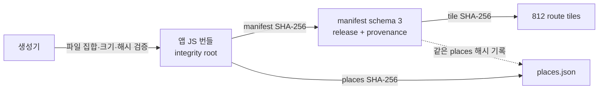

# 보안 개선 PR 3 — 정적 데이터 무결성과 취소 가능한 경로 Worker

- 작성일: 2026-07-15
- 상태: 구현 및 로컬 품질 게이트 검증 완료, 아직 커밋 전
- 범위: 서울 manifest·타일·장소 아티팩트, 데이터 생성·빌드 검증, 경로 계산 Worker, 앱 수명주기 취소
- 비범위: OSM endpoint connector 접근 정책, 앱인토스 플랫폼 서명 정책, 의존성 전체 교체

## 결론

PR 3은 배포·캐시·CDN에서 서울 정적 데이터가 서로 다른 버전으로 섞여도 앱이 경로 계산을 계속하던 문제를 막는다. 앱 번들은 manifest와 places SHA-256을 직접 고정하고, manifest는 각 타일과 places SHA-256을 기록한다. 로더는 원본 바이트를 JSON 파싱 전에 검증하며 한 바이트라도 다르면 `ROUTE_ARTIFACT_MISMATCH`로 종료한다.

경로 데이터 로드, compact 확장, 그래프 생성, 그늘 계산, A* 탐색은 별도 module Web Worker에서 실행한다. 계산 중 앱이 수명주기 이벤트를 받으면 Worker를 `terminate()`해 그 실행 컨텍스트의 CPU 작업과 fetch 처리를 중단한다. 이미 완료한 경로는 백그라운드 전환 뒤에도 유지한다. 운영체제·WebView 네트워크 계층이 이미 시작한 전송을 언제 해제하는지는 이 테스트가 보장하지 않는다.

## 처리한 발견 사항

| ID      | 심각도 | 문제                                                      | PR 3 결과                                                         |
| ------- | ------ | --------------------------------------------------------- | ----------------------------------------------------------------- |
| DSC-040 | Medium | manifest·타일·장소 인덱스가 서로 암호학적으로 묶이지 않음 | 번들 고정 root → manifest → 개별 아티팩트 SHA-256 검증            |
| DSC-041 | Low    | stale-result 가드가 경로 계산 CPU·fetch를 취소하지 못함   | 요청당 Worker, 30초 제한, abort·unmount·pagehide 시 `terminate()` |

심각도는 영향과 공격 조건을 함께 반영했다. 정적 데이터는 same-origin 배포 자산이므로 일반 원격 사용자가 DSC-040을 직접 유발할 수 없다. 실제 조건은 불완전한 배포, 스테일 CDN/WebView 캐시, 빌드 파이프라인 오염 또는 same-origin 응답을 바꾸는 공급망 권한이다. 이 제약 때문에 High로 평가하지 않았다.

## DSC-040 — 버전이 섞인 경로 데이터 수용 (Medium)

1. **정확한 위치**

   - 수정 전: `scripts/build-seoul-tiles.mjs:320-336`, `src/domain/routing/tileRouteData.ts:82-103, 336-377`, `src/domain/places/loadSeoulPlaces.ts:103-117`
   - 방어 코드: [`scripts/build-seoul-tiles.mjs:466`](../../scripts/build-seoul-tiles.mjs#L466), [`scripts/artifact-integrity.mjs:35`](../../scripts/artifact-integrity.mjs#L35), [`tileManifestValidation.mjs:110`](../../src/domain/routing/tileManifestValidation.mjs#L110), [`tileRouteData.ts:351`](../../src/domain/routing/tileRouteData.ts#L351), [`fetchJson.ts:68`](../../src/domain/data/fetchJson.ts#L68), [`loadSeoulPlaces.ts:104`](../../src/domain/places/loadSeoulPlaces.ts#L104)

2. **공격 조건과 실제 경로**

   공격자나 오류 상태가 manifest, 개별 타일, 장소 인덱스 중 일부만 이전·이후 버전으로 제공해야 한다. 예를 들어 새 manifest와 같은 tile ID·schema를 쓰는 예전 타일이 함께 제공되면, 수정 전 로더는 ID·형식·크기만 통과시켰다. 앱은 새 보행 정책과 예전 geometry를 결합해 잘못된 경로를 계산할 수 있었다.

3. **코드 근거**

   수정 전 manifest entry는 `id`, `bounds`, `bytes`만 갖고, 타일 로더는 `entry.bytes + 1,024` 크기 제한과 JSON schema만 검증했다. 장소 인덱스도 파일 출처나 버전에 묶이지 않았다. 현재 생성기는 원본 PBF, manifest, 타일, 장소, 경계 파일의 크기와 SHA-256을 기록한다. 번들에 포함된 integrity root가 manifest 해시를 고정하고, manifest가 개별 파일 해시를 고정한다. Node 빌드 검증기와 브라우저 런타임은 같은 manifest validator와 상한을 사용한다.

4. **오탐 가능성**

   앱인토스 `.ait` 산출물과 호스팅 계층이 이미 파일 해시·원자적 배포를 보장한다면 실제 발생 가능성은 더 낮다. 다만 저장소 코드와 로컬 자료만으로 해당 보장을 입증할 수 없었고, 스테일 WebView/CDN 캐시와 부분 배포는 현실적인 운영 실패 모드다. 그래서 코드 차원에서 잘못된 조합을 거부한다.

5. **최소 수정**

   - manifest schema를 3으로 올리고 release ID, 생성기 버전, 원본 파일 메타데이터, 개별 SHA-256을 필수로 만든다. 다운로드 URL과 취득 시각은 현재 nullable이다.
   - 번들에 manifest·places 해시를 생성 모듈으로 포함한다. places는 번들 root에서 직접 검증하고 manifest에서도 같은 해시를 요구한다.
   - 원본 바이트를 JSON 파싱 전에 Web Crypto SHA-256으로 검증한다.
   - 배포 디렉터리를 교체하기 전에 staging 산출물을 검증하고, 빌드 전 `npm run data:verify`로 812개 타일의 정확한 파일 집합, 크기, 해시, release ID를 전수 검증한다.
   - `data:seoul`이 public 경계와 런타임 `seoulBoundary.ts`를 같은 원본에서 함께 만들며, `data:verify`가 두 산출물의 drift를 모두 거부한다.

6. **필요 보안 테스트**

   - 정상 manifest·타일 조합 수용
   - 새 manifest + 같은 ID의 예전 타일 거부
   - manifest와 타일을 함께 바꿔도 번들 root와 다르면 거부
   - 장소 인덱스 1-byte 변경 거부

   - 중복 tile ID, 오포함·누락 타일, 없는 해시 거부
   - 빈 manifest, 1MB 초과 manifest, 2,000개 초과 타일, 잘못된 bounds·provenance·보행 정책 거부
   - 원본 경계와 public JSON·런타임 TypeScript 경계의 1-byte drift 거부

## DSC-041 — 결과만 무시하고 CPU·fetch는 계속되는 경로 계산 (Low)

1. **정확한 위치**

   - 수정 전: `src/App.tsx:180-185, 187-234`; 실제 작업은 `src/domain/routing/routeService.ts`의 타일 로드·그래프·그늘·A* 경로
   - 방어 코드: [`App.tsx:179`](../../src/App.tsx#L179), [`App.tsx:207`](../../src/App.tsx#L207), [`App.tsx:216`](../../src/App.tsx#L216), [`routeWorkerClient.ts:28`](../../src/domain/routing/routeWorkerClient.ts#L28), [`routeWorkerClient.ts:128`](../../src/domain/routing/routeWorkerClient.ts#L128), [`route.worker.ts:17`](../../src/domain/routing/route.worker.ts#L17)

2. **공격 조건과 실제 경로**

   정상적으로 복잡한 3km 경로나 상한 안의 복잡한 정적 타일이 필요하다. 사용자가 경로 계산 중에 WebView를 닫거나 백그라운드로 보내도, 수정 전 request ID는 나중 도착한 React 상태 갱신만 무시했다. 데이터 fetch, JSON 파싱, 객체 확장, 그래프 생성, 그늘 판정, A* 탐색은 메인 스레드에서 완료될 때까지 계속됐다. 결과적으로 입력·애니메이션이 느려지거나 WebView가 응답 없음 상태가 될 수 있었다.

3. **코드 근거**

   수정 전 `latestRequest` 비교는 `await` 이후에만 있었고 작업에 `AbortSignal`을 전달하지 않았다. 현재 클라이언트는 요청마다 module Worker를 하나 만들고, abort·30초 제한·worker error·message error·정상 완료 모두에서 listener를 제거한 뒤 `terminate()`한다. 앱은 결과 무효화, unmount, `pagehide`, `visibilitychange=hidden`에서 controller를 abort한다.

4. **오탐 가능성**

   [PR 1의 작업량 상한](./pr1-webview-resource-hardening.md)이 이미 비정상적으로 큰 입력을 차단하고, 일반 원격 사용자가 다른 사용자의 WebView CPU를 소모시키는 구조도 아니다. 로컬 가용성과 응답성 문제에 가까워 Low로 평가했다. 다만 정상 최대 작업이 모바일 메인 스레드에 남아 있다는 코드 경로는 명확했다.

5. **최소 수정**

   - Vite의 same-origin module Worker 형식으로 경로 계산을 분리한다.
   - 요청당 Worker를 생성하여 중단 시 메시지 협력을 기다리지 않고 프로세싱 컨텍스트를 종료한다.
   - 입력·출력 schema, 좌표, 문자열, 세그먼트 수, 경로 모드 중복을 메시지 경계에서 검증한다.
   - 예상한 도메인 오류 코드만 허용하고 stack·예외 상세는 UI로 전달하지 않는다.

6. **필요 보안 테스트**

   - 정상 결과 수신 후 Worker 종료
   - 호출자 abort·deadline·worker crash·message decode 실패 시 Worker 종료
   - 작업 중 unmount·`pagehide` 시 AbortSignal 전파
   - 과대·비정상 출력, 중복 모드, 비정상 좌표 거부
   - `request: null`, 허용되지 않은 출발 오프셋, 과대 문자열 거부

## 아티팩트 신뢰 연결

개별 타일 해시만 mutable manifest에 넣으면 manifest와 타일을 함께 바꾸는 변조를 막지 못한다. 그래서 신뢰 시작점을 배포 JS 번들 안에 둔다. `public/data/seoul/boundary.json`은 manifest와 빌드 검증기가 해시를 검증하지만, 런타임 서울 경계 판정은 번들에 포함된 `src/data/seoulBoundary.ts`를 쓰므로 이 public JSON을 fetch하지 않는다. 두 경계 산출물은 같은 원본과 생성 실행을 사용하고, `data:verify`는 원본에서 런타임 모듈을 다시 계산해 정확히 비교한다. 반대로 공격자가 JS 번들과 모든 데이터를 함께 교체할 수 있다면 이 구조만으로는 막지 못한다. 완전한 번들 교체 방어는 앱인토스 아티팩트 서명·배포 정책의 신뢰 범위다.

## 성능·빌드 결과

| 항목             |             PR 2 |             PR 3 | 해석                                   |
| ---------------- | ---------------: | ---------------: | -------------------------------------- |
| main minified JS |       1,476.76KB |       1,456.65KB | 경로 계산 코드가 Worker 청크로 이동    |
| main gzip JS     |         471.01KB |         462.95KB | 초기 메인 청크는 소폭 감소             |
| route Worker     |             없음 |          69.42KB | Vite가 별도 module Worker 파일로 생성  |
| `.ait`           | 23,069,840 bytes | 23,125,319 bytes | 해시·provenance manifest와 Worker 포함 |

이 변경은 전체 경로 계산 시간을 줄였다고 주장하지 않는다. 같은 알고리즘을 다른 스레드에서 실행하므로 핵심 개선은 메인 스레드 응답성과 확실한 취소다. 실기기 지연·프레임 측정은 별도 QA로 남겨 둔다.

## 검증 결과

2026-07-15 로컬 검증:

- `npm run data:verify`: manifest, places, public·runtime boundary, 812개 타일 전수 검증 통과
- `npm run test:coverage`: 37개 파일, 229개 테스트 통과
- 커버리지: 문장 87.01%, 분기 83.38%, 함수 92.28%, 라인 90.78%
- `npm run typecheck`: 통과
- `npm run lint`: 통과
- `npm run build`: prebuild 아티팩트 검증, Vite Worker 청크, 앱인토스 `.ait` 생성 통과

핵심 회귀 테스트:

- `src/domain/routing/tileRouteIntegrity.test.ts`
- `scripts/artifact-integrity.test.mjs`
- `scripts/seoul-boundary-artifacts.test.mjs`
- `src/domain/data/fetchJson.test.ts`
- `src/domain/places/loadSeoulPlaces.test.ts`
- `src/domain/routing/routeWorkerClient.test.ts`
- `src/domain/routing/routeWorkerProtocol.test.ts`
- `src/App.test.tsx`
- `src/domain/routing/realSeoulData.test.ts`
- `src/domain/routing/realWalkingPolicy.test.ts`

### 재현 기준

- 기준 작업 트리: `main` 브랜치, base `010e6e3`, 커밋 전 PR 2·PR 3 변경 포함
- 로컬 런타임: Node.js 25.9.0, npm 11.12.1
- 측정 명령: `npm run data:verify`, `npm run test:coverage`, `npm run typecheck`, `npm run lint`, `npm run build`
- 빌드 청크 크기는 Vite/앱인토스 생산 빌드 로그, `.ait` 크기는 `wc -c shade-route.ait`로 측정

현재 PR 2·PR 3가 커밋되지 않았으므로 이 문서만으로 정확한 작업 트리를 재현할 수 없다. 위 명령은 현재 로컬 작업 트리의 검증 절차다. 커밋을 만들 때 기준을 실제 PR 3 commit SHA로 교체해야 재현 기준이 완성된다.

## 호환성과 남은 위험

- **실기기 호환성:** 생산 빌드는 module Worker 청크를 정상 생성했다. 다만 현재 로컬 환경에서 앱인토스 iOS/Android WebView의 `Worker` + `crypto.subtle` 지원을 실기기로 확인하지 못했다. 미지원 환경에서는 무결성 검증을 생략하지 않고 경로 로드가 실패한다.
- **캐시 가용성:** 예전 파일이 섞이면 잘못된 경로 대신 fail-closed 오류가 나온다. immutable release URL이나 오프라인 캐시 교체 정책은 아직 없으므로, 배포 후 스테일 캐시에서 일시적 경로 실패가 생길 수 있다.
- **완전한 JS 교체:** 이 integrity root는 배포 JS를 신뢰한다. 공격자가 JS와 데이터를 모두 바꾸는 권한을 얻으면 플랫폼 서명 없이는 방어할 수 없다.
- **provenance 빈칸:** 현재 manifest는 원본 파일명·크기·수정 시각·SHA-256을 기록한다. 이번에 쓴 원본의 실제 다운로드 URL과 취득 시각은 확인할 수 없어 `null`로 기록했다. 다음 갱신부터 `OSM_SOURCE_URL`, `OSM_DOWNLOADED_AT`을 필수 운영 절차로 넣어야 한다.
- **CSP:** Worker는 `blob:`이나 `eval`을 쓰지 않는 same-origin 별도 청크다. 이 PR은 CSP 헤더를 새로 설정하지 않았다. 정적 호스팅 계층이 헤더를 제어하는지 확인한 뒤 `worker-src 'self'`를 포함한 CSP를 별도로 적용한다.
- **후속 보안 작업:** [PR 2에서 남겨 둔 endpoint connector](./pr2-osm-pedestrian-semantics.md)의 제한 geometry 교차·출입구 접근 등급은 이 PR의 데이터 무결성·Worker 범위와 별개다.

## 운영 메모

- 서울 데이터를 수정한 뒤 `src/data/seoulArtifactIntegrity.mjs`나 `src/data/seoulBoundary.ts`를 손으로 바꾸지 않는다. `npm run data:seoul`이 public 데이터, integrity root, 런타임 경계를 함께 생성한다.
- `npm run data:verify`를 독립 CI 단계로도 실행한다. `npm run build`는 `prebuild`에서 같은 검증을 자동 실행한다.
- `ROUTE_ARTIFACT_MISMATCH`가 발생하면 상한을 높이거나 검증을 끄지 않는다. 배포 번들·manifest·타일·places가 같은 생성 실행에서 나왔는지 먼저 확인한다.
- 30초 제한을 늘리기 전에 실패 지역의 타일 수, JSON 바이트, 그래프 규모, A* 탐색량을 먼저 측정한다.
